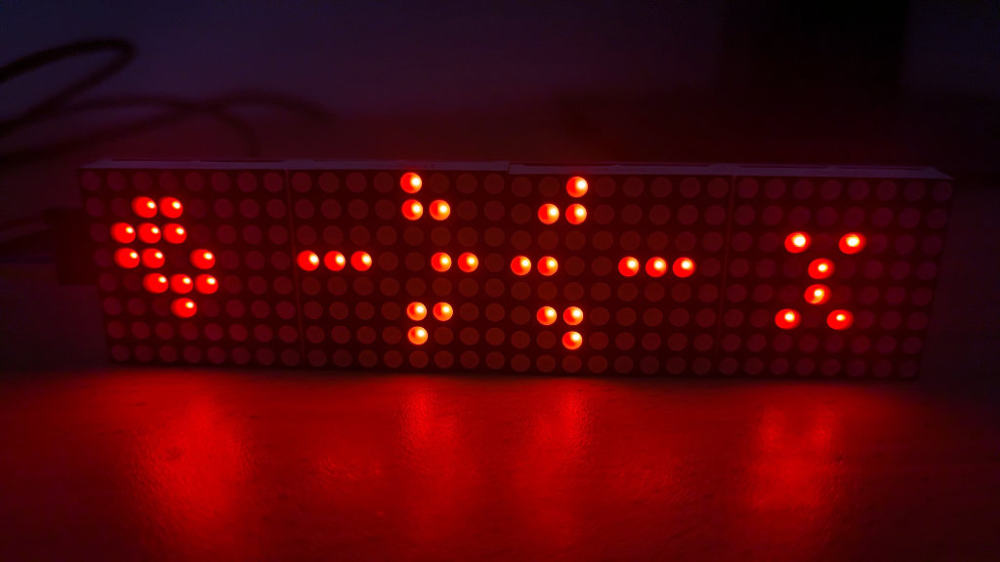

# Conway's Game of Life in Silicon

   

This is a hardware implementation of [Conway's Game of Life](https://en.wikipedia.org/wiki/Conway%27s_Game_of_Life) in Verilog. It is designed for [Tiny Tapeout](https://tinytapeout.com).

