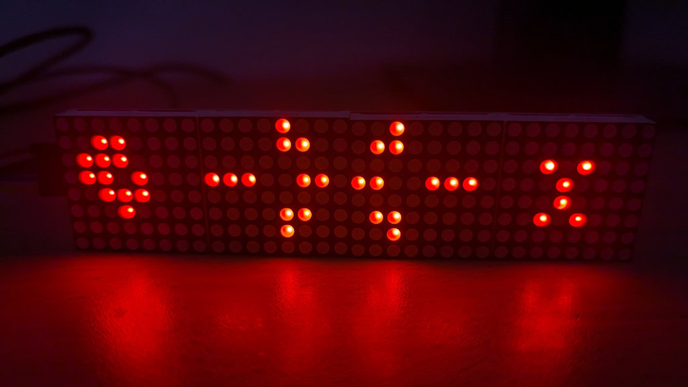
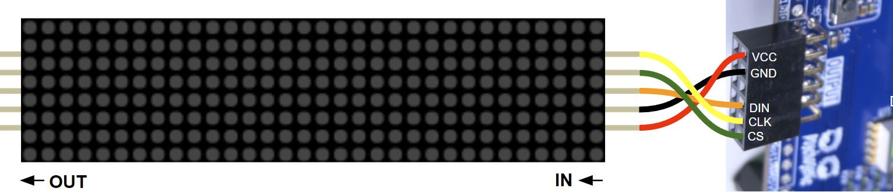
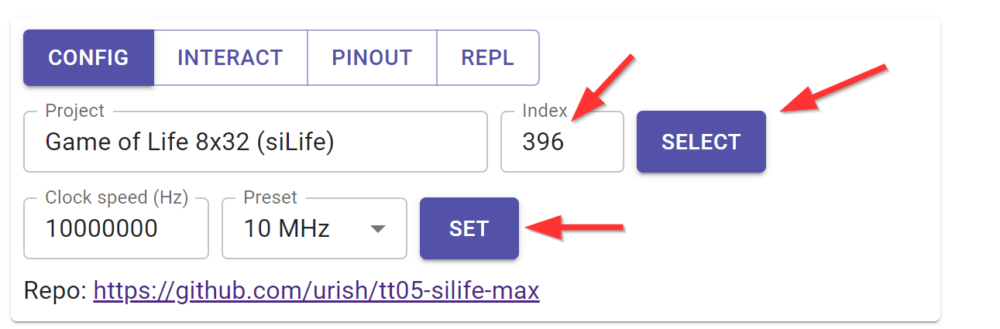
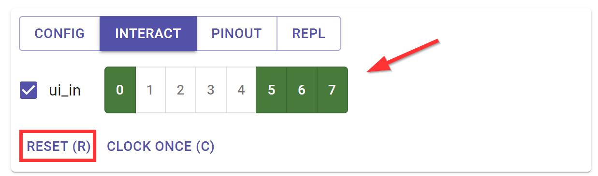

# Conway's Game of Life in Silicon - Bring up

Hardware required:

- MAX7219 32x8 LED Dot Matrix
- 5 jumper wires

## Connections

Connect the 5 jumper wires between the side marked "IN" on the MAX7219 matrix and the "OUTPUT" port of the demo board as follows:

| OUTPUT pin | MAX7219 pin |
|------------|-------------|
| ot0        | CS          |
| ot1        | CLK         |
| ot2        | DIN         |
| GND        | GND         |
| 3v3        | VCC         |

## Demo patterns

The project comes preprogrammed with two demo patterns: [demo_1](../src/demo_1.lif) and [demo_2](../src/demo_2.lif). To project in demo mode:

1. Open the [Tiny Tapeout commander app](https://commander.tinytapeout.com) and connect to your Tiny Tapeout demo board.
2. Select design number 396 "Game of Life 8x32 (siLife)", and click on the blue **SELECT** button.
3. Set the clock speed to 10 MHz, and click on the blue **SET** button.
4. Go to the INTERACT tab, check "ui_in" and click on the following buttons: **0**, **5**, **6**, **7**.
5. Click on the **RESET (R)** button.

You should see the demo pattern comes to life on the MAX7219 display. Due to a [design bug](https://github.com/urish/tt05-silife-max/issues/1), the animation may take several minutes to start for the first time. A workaround would be to speed up the project clock to 40 MHz, which will reduce the startup delay to less than 2 minutes.

You can switch to the second demo pattern by turning off button **0** and reseting the project.

Toggle button **6** to pause/reset the animation.

